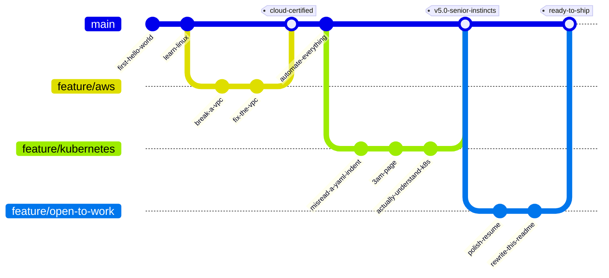
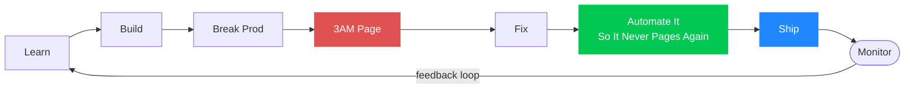

<div align="center">

```
██████╗  █████╗ ██╗  ██╗██╗   ██╗██╗         ██████╗ ███████╗██╗   ██╗ ██████╗ ██████╗ ███████╗
██╔══██╗██╔══██╗██║  ██║██║   ██║██║         ██╔══██╗██╔════╝██║   ██║██╔═══██╗██╔══██╗██╔════╝
██████╔╝███████║███████║██║   ██║██║         ██║  ██║█████╗  ██║   ██║██║   ██║██████╔╝███████╗
██╔══██╗██╔══██║██╔══██║██║   ██║██║         ██║  ██║██╔══╝  ╚██╗ ██╔╝██║   ██║██╔═══╝ ╚════██║
██║  ██║██║  ██║██║  ██║╚██████╔╝███████╗    ██████╔╝███████╗ ╚████╔╝ ╚██████╔╝██║     ███████║
╚═╝  ╚═╝╚═╝  ╚═╝╚═╝  ╚═╝ ╚═════╝ ╚══════╝    ╚═════╝ ╚══════╝  ╚═══╝   ╚═════╝ ╚═╝     ╚══════╝
```


</div>

<div align="center">


</div>

---

## 🗂️ My Career, As a Git History



---

## 🔀 The Pipeline (a.k.a. how I got here)



---

## 🖥️ `systemctl status rahul.service`

```
● rahul.service - DevOps Engineer, Hyderabad IN
     Loaded: loaded (5+ years, enabled)
     Active: active (running)

┌───────────────────────────────────────────────┐
│  SERVICE                    STATUS             │
├───────────────────────────────────────────────┤
│  ✅ coffee-supply            RUNNING            │
│  ✅ ci-cd-pipelines          RUNNING            │
│  ✅ curiosity.timer          RUNNING             │
│  ✅ automate-the-boring-bits RUNNING            │
│  ⚠️  sleep-schedule           DEGRADED          │
│  ✅ open-to-opportunities    RUNNING            │
└───────────────────────────────────────────────┘

Aug 24 09:41:02 rahul systemd[1]: Started rahul.service.
Aug 24 09:41:02 rahul kernel: production incident resolved before coffee got cold.
```

---

## 🛠 Tech Stack — CI/CD View

<table>
<tr>
<td valign="top" width="50%">

**☁️ Infra as Code**


**🔄 CI/CD**


</td>
<td valign="top" width="50%">

**🐳 Containers & Orchestration**


**📊 Observability**


**💻 Scripting & OS**


</td>
</tr>
</table>

---

## 📈 Live Metrics Dashboard

<div align="center">


</div>

### 🐍 Deploying a snake to eat my own contribution graph

<div align="center">

<picture>
  <source media="(prefers-color-scheme: dark)" srcset="https://raw.githubusercontent.com/rahulswargam/rahulswargam/output/github-contribution-grid-snake-dark.svg" />
  <source media="(prefers-color-scheme: light)" srcset="https://raw.githubusercontent.com/rahulswargam/rahulswargam/output/github-contribution-grid-snake.svg" />
  
</picture>

<sub>generated nightly by <a href=".github/workflows/snake.yml">.github/workflows/snake.yml</a> — real CI/CD, eating real commit history</sub>

</div>

---

<details>
<summary>📜 <code>cat /etc/motd</code></summary>
<br/>

```
Last login: today from 127.0.0.1
Welcome to rahul-swargam-prod, an on-call human.

  * "It's not a bug, it's an undocumented feature of the rollback."
  * Uptime is a personality trait.
  * Terraform plan reviewed twice. Applied once. Prayed always.
  * Friday deploys require: passing tests, a rollback plan, and courage.
  * # this incident is now a runbook
```

</details>

---

## 🎮 Play: Incident Commander

<div align="center">


*A branching, click-to-expand DevOps incident simulator. No install, no JS, just `<details>` tags and bad decisions.*

</div>

<details>
<summary><b>▶️ 03:14 AM — PagerDuty goes off. Click to start the incident.</b></summary>
<br/>

**🔴 ALERT:** `checkout-service` p99 latency is spiking. Error rate climbing. Customers can't check out.

What's your first move?

<details>
<summary>A) Roll back the last deploy</summary>
<br/>

You run `kubectl rollout undo deployment/checkout-service`. Latency drops. Error rate flatlines.

`+10 sanity` · `-5 ego (it wasn't even your deploy)`

<details>
<summary>▶️ Write the postmortem?</summary>
<br/>

You write a blameless postmortem. Root cause: an untested connection-pool change slipped past review.

### 🏆 ENDING: Hero of the Incident
Page closed in 12 minutes. You ship a canary check so this class of bug never reaches prod again.

</details>
</details>

<details>
<summary>B) Scale up the pods and hope</summary>
<br/>

You run `kubectl scale --replicas=20`. Latency improves slightly. Error rate doesn't move.

Turns out it was never a capacity problem.

<details>
<summary>▶️ Check the logs?</summary>
<br/>

`kubectl logs -f` reveals a bad DB migration mid-flight, quietly locking rows.

### 😅 ENDING: Survived, Barely
47 minutes to resolution. "Check the logs before scaling" goes into the runbook, in bold.

</details>
</details>

<details>
<summary>C) SSH into prod and debug live, no safety net</summary>
<br/>

Bold. Risky. You forget to `tmux`. Your laptop sleeps. You lose your shell mid-fix.

### 💀 ENDING: Game Over
The incident review adds a new agenda item: *"no more cowboy debugging."*

`+1 legend status in #incidents` · `-20 trust from your manager`

</details>

<br/>

*Choose again by re-opening this section — production waits for no one.*

</details>

---

## 🌐 Connect With Me

<div align="center">

[](https://www.rahulswargam.online)
[](https://www.linkedin.com/in/rahulswargam)
[](mailto:swargamrahul@gmail.com)

</div>

---

<div align="center">

```bash
$ echo "Thanks for stopping by. Now go check my repos before the build breaks."
```

⭐ *Explore my repositories for real-world DevOps, cloud automation, and CI/CD implementations.*


</div>
