## `// FEATURED_PROJECTS`

> [!IMPORTANT]
> **[complete-devops-guide](https://github.com/rahulswargam/complete-devops-guide)**
> Comprehensive DevOps study guide — Linux, Git, Docker, CI/CD, IaC, Kubernetes, Observability & DevSecOps.
> `Linux` `Docker` `Kubernetes` `CI/CD` `DevSecOps`

> [!TIP]
> **[netflix-style-devops-portfolio](https://github.com/rahulswargam/netflix-style-devops-portfolio)**
> Cinematic Netflix-inspired DevOps portfolio built with React, Vite, Tailwind CSS, and GSAP.
> `React` `Vite` `Tailwind CSS` `GSAP`

> [!NOTE]
> **[ToolboxCLI](https://github.com/rahulswargam/ToolboxCLI)**
> Single-file, cross-platform CLI toolkit — arrow-key navigable, 15 tools for images, PDFs, and downloads.
> `Python` `CLI`

## `// SYSTEM_ANALYTICS`

<picture>
  <source media="(prefers-color-scheme: dark)" srcset="https://raw.githubusercontent.com/rahulswargam/rahulswargam/output/github-contribution-grid-snake-dark.svg" />
  <source media="(prefers-color-scheme: light)" srcset="https://raw.githubusercontent.com/rahulswargam/rahulswargam/output/github-contribution-grid-snake.svg" />
  
</picture>

generated nightly by <a href=".github/workflows/snake.yml">.github/workflows/snake.yml</a>

 

<table>
<tr>
<td width="50%"></td>
<td width="50%"></td>
</tr>
</table>

## `// RECENT_ACTIVITY`

<!--START_SECTION:activity-->
<!--END_SECTION:activity-->

auto-refreshed every 6 hours by <a href=".github/workflows/activity.yml">.github/workflows/activity.yml</a>

## `// CONNECT`

SYSTEM DEPLOYMENT SUCCESSFUL // PROFILE REDESIGNED

